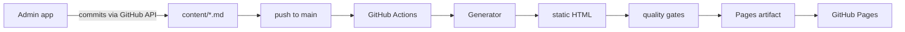

# StaticBlaze

A Jekyll alternative built with .NET. The blog is a folder of markdown in a GitHub
repository; a generator turns it into a plain static site; GitHub Pages serves it for free.
A Blazor WebAssembly admin app at `/admin/` is the only .NET that ever runs client-side.

**Live site: [https://sudoscratchy.github.io/StaticBlaze/](https://sudoscratchy.github.io/StaticBlaze/)**

Visitors get pre-built HTML: no WASM download, no runtime rendering, full SEO.

## How it works



- **Markdown is the only canonical content.** HTML is always derived at build time through
  the same Markdig pipeline the admin preview uses, so what you preview is what ships.
- **No database.** A generated `manifest.json` is the index (fetch-once, cacheable).
  Related posts, tag counts, and pagination are computed at build time and cannot drift.
- **GitHub is the CMS.** The admin writes markdown/JSON through the contents API with
  proper SHA handling (creates without sha, updates with sha, 409 refetch-and-retry).
- **Deployment needs no PAT.** The workflow uses OpenID Connect: GitHub issues the job a
  short-lived token, and `actions/deploy-pages` exchanges it. There is no long-lived
  secret in CI at all.

## Repository layout

| Path | What it is |
|---|---|
| `content/` | the blog: `site.json`, `posts/*.md` (typed YAML frontmatter), `authors/*.json`, `taxonomy/*.json`, `assets/` |
| `src/StaticBlaze.Core` | models, frontmatter (YamlDotNet), the one Markdig pipeline, mermaid preprocessor, manifest/search builders |
| `src/StaticBlaze.Site` | Razor components used as static templates |
| `src/StaticBlaze.Generator` | console app that validates content and emits the whole site |
| `src/StaticBlaze.Admin` | Blazor WASM editor (Toast UI) with an encrypted PAT vault |
| `styles/` | Tailwind v4 entrypoints, the token layer, `static/*.js` (UI, motion, 3D graph) |
| `styles/vendor/` | vendored GSAP, Three.js and mermaid builds + their licence files |
| `tools/node-tools` | pinned `tailwindcss` + `@tailwindcss/cli` for local and CI builds |
| `tools/*.mjs` | build-time gates: site audit, cross-engine CSS check, casing check, local server |
| `tests/` | `StaticBlaze.Core.Tests` (unit) and `StaticBlaze.Site.Tests` (golden-file HTML contract) |
| `docs/` | documentation map, scan, IA, design system, analytics, verification, handoff, change guides |

---

## Startup guide

This is the whole path from an empty machine to a live post. Every command has been run
end to end on a clean checkout.

### 0. Prerequisites

| Tool | Version | Why | Check |
|---|---|---|---|
| .NET SDK | **10.x** | runs the generator, tests and admin | `dotnet --info` |
| Node.js | 20+ | runs the pinned Tailwind CLI (build-time only, never shipped) | `node --version` |
| Git | any recent | clone + commit | `git --version` |
| A browser | any | the final check | |

> **Windows PATH trap.** If `dotnet --info` prints no SDKs, the first `dotnet` on `PATH` is a
> runtime-only shim. Fix it for the session:
> `set PATH=C:\Program Files\dotnet;%PATH%` (cmd) or `$env:PATH="C:\Program Files\dotnet;"+$env:PATH` (PowerShell).

### 1. Clone and restore

```bash
git clone https://github.com/SudoScraTchY/StaticBlaze.git
cd StaticBlaze
dotnet restore StaticBlaze.slnx
```

### 2. Run the tests

```bash
dotnet test StaticBlaze.slnx
```

Expect **27 passing, 0 failed**: 19 Core unit tests plus 8 golden-file tests that pin the
HTML template contract. If a golden test fails after you intentionally changed a template,
the test output writes the new render next to the fixture as `*.actual` for you to review
and re-baseline from.

### 3. Build the stylesheets

The CSS entrypoints import Tailwind directly from `tools/node-tools`, so local builds and
CI resolve identically with no global install.

```bash
npm ci --prefix tools/node-tools

# public stylesheet
node tools/node-tools/node_modules/@tailwindcss/cli/dist/index.mjs \
     -i styles/site.css -o dist-assets/site.css --minify

# admin stylesheet
node tools/node-tools/node_modules/@tailwindcss/cli/dist/index.mjs \
     -i styles/admin.css -o src/StaticBlaze.Admin/wwwroot/assets/admin.css --minify
```

### 4. Generate the site

```bash
dotnet run --project src/StaticBlaze.Generator -c Release -- \
     --content content --out dist --css dist-assets/site.css \
     --static styles/static --vendor styles/vendor --fonts styles/fonts
```

The `--css` flag is what makes a clean local run produce a *styled* site: without it the
generator still emits every page but never writes `dist/assets/site.css`. The generator is
strict: an undeclared tag, a duplicate canonical or an over-long description fails the build
with a named cause instead of shipping.

### 5. Serve it locally

```bash
node tools/serve.mjs
# open http://localhost:8077/StaticBlaze/
```

`tools/serve.mjs` already knows the `/StaticBlaze/` base path, so what you see locally is
what GitHub Pages serves. **Verify the served bytes before trusting a browser result**: a
stale server bound to a reused port has bitten this project before.

### 6. Styling and customisation

Everything visual is a CSS custom property in `styles/_tokens.css`, mapped onto Tailwind v4
through `@theme inline` (there is no `tailwind.config.js`).

| I want to change… | Edit | Notes |
|---|---|---|
| Colours | `styles/_tokens.css` | firouzeh `#57c5c6` is the single accent; ground `#06070d`, never pure black |
| Fonts | `styles/_tokens.css` | IBM Plex Sans / mono; self-hosted webfonts in `styles/fonts/`, regenerate with `pwsh tools/get-fonts.ps1` |
| Radii / spacing | `styles/_tokens.css` | one small radius scale (2 / 6 / 12px) |
| Site copy, nav, hero | `content/site.json` | every rendered string comes from here |
| Authors, tags, categories | `content/authors/*.json`, `content/taxonomy/*.json` | tags must be declared before a post can use them |
| 3D graph palette | `styles/_tokens.css` | `scene.js` reads the same tokens at runtime, so WebGL cannot drift from CSS |
| Motion timings | `styles/static/motion.js` | GSAP timelines only; there is no `addEventListener('scroll')` anywhere |

After any CSS edit, rebuild both stylesheets (step 3) and regenerate (step 4). The 3D scene,
the graph view and the page transitions all degrade: reduced-motion, save-data, small
viewports, no-WebGL and context loss each have a named fallback state (`data-scene` on `<html>`).

### 7. Run the admin (optional)

```bash
dotnet run --project src/StaticBlaze.Admin
# open the printed URL, then /unlock
```

Write posts in a live preview that runs the same pipeline as the generator; pasted images
are compressed and uploaded as content-addressed assets.

### 8. Write and publish a post

1. Create `content/posts/YYYY-MM-DD-my-post.md`:

   ```markdown
   ---
   title: "My Post"
   slug: my-post
   description: "One or two sentences, 60 to 163 characters. The audit gate enforces this."
   author: mehrshad
   category: meta
   tags: [github]
   published: 2026-09-28T12:00:00Z
   featured: false
   ---
   Body text. Mermaid fences render in the browser:

   ```mermaid
   flowchart LR
       A[push] --> B[build] --> C[deploy]
   ```
   ```

2. Register any new tag in `content/taxonomy/tags.json` or the build fails.
3. Commit to `main` and push. The deploy workflow runs automatically.

### 9. Deploy (and how hosting is configured)

- **Hosting**: GitHub Pages, published by the `deploy` workflow
  (`.github/workflows/deploy.yml`), which runs on every push to `main` and on demand
  (`workflow_dispatch`).
- **One-time setting**: *Settings → Pages → Build and deployment → Source → **GitHub
  Actions***. This is already done for this repository. If the source is ever set back to
  "Deploy from a branch", GitHub's legacy Jekyll builder publishes on every push and races
  this workflow for the URL; the workflow's last step detects that and fails loudly instead
  of silently overwriting.
- **No PAT in CI**: the workflow declares `permissions: contents: read, pages: write,
  id-token: write` and deploys over OIDC. Nothing to rotate, nothing to leak.
- Manual redeploy: *Actions → deploy → Run workflow*.

### 10. Verify the deployment

The workflow's final step does this for you on every run: it fetches the live URL, asserts
the built shell marker is present, and asserts `/posts/ /contact/ /archive/ /tags/` all
return 200. To check by hand:

```bash
curl -fsS https://sudoscratchy.github.io/StaticBlaze/ | grep -c 'class="cockpit"'   # 1
curl -s -o /dev/null -w '%{http_code}\n' https://sudoscratchy.github.io/StaticBlaze/posts/   # 200
```

### 11. Rollback

| Situation | Action |
|---|---|
| A bad post went live | `git revert <commit>` on `main` and push; the pipeline republishes the previous state in ~2 minutes |
| The workflow itself is broken | *Actions → deploy →* pick the last green run → **Re-run all jobs**; the stored artifact republishes |
| You need the site down now | *Settings → Pages → Unpublish site* |
| A change is stuck in review | push it to any branch; only `main` deploys |

### 12. Troubleshooting

| Symptom | Cause | Fix |
|---|---|---|
| Deploy fails at `Check file casing` | a file was committed with different case than the solution references | rename via an intermediate name; the check names the file |
| Deploy fails at `Test` | a golden-file fixture changed without review, or a real regression | read the diff the test prints; re-baseline only deliberately |
| Deploy fails at `Quality gates` | audit or cross-engine check failed on the built output | the log names the page and reason (thin description, old tokens, unprefixed CSS) |
| Deploy fails at `Verify the published site` | Pages Source reverted to "Deploy from a branch" | set Source back to **GitHub Actions** and re-run |
| Site shows a Jekyll-rendered README | same as above, seen live | same fix; then redeploy |
| Diagrams show source text | mermaid failed to load or render | the page says why next to the diagram; check `dist/assets/vendor/mermaid.min.js` exists |
| Comments section missing | `Comments` not configured in `content/site.json` | add the giscus block (below) |
| Graph looks like a starfield | old `scene.js` cached | hard-refresh; `data-scene="live"` must be on `<html>` |

---

## Comments (GitHub Discussions via giscus)

Comments are **off by default** and need no server, no database and no PAT: readers sign in
with their own GitHub session and comments live in this repository's Discussions.

To enable:

1. *Settings → General → Features →* **Set up discussions**, then create one category
   (Announcements works well; only maintainers can create there, which keeps moderation simple).
2. Install the [giscus GitHub App](https://github.com/apps/giscus) and grant it this repository.
3. Open [giscus.app](https://giscus.app), enter `SudoScraTchY/StaticBlaze`, pick the category,
   and copy the two ids it shows.
4. Add to `content/site.json`:

```json
"comments": {
  "enabled": true,
  "repo": "SudoScraTchY/StaticBlaze",
  "repoId": "R_kg…",
  "category": "Announcements",
  "categoryId": "DIC_kwD…",
  "mapping": "pathname",
  "theme": "dark_dimmed",
  "lang": "en"
}
```

Push. Every post page now renders a comments section; the mapping is the post's pathname, so
each post owns one discussion. **No token of any kind is stored on the site** — giscus runs
entirely in the reader's browser against GitHub.

## Token handling (PATs), stated precisely

- **CI uses no PAT at all** (OIDC + `GITHUB_TOKEN` with least privilege). There is nothing to
  store, rotate or leak for deployment.
- The **admin app** is the only place a PAT exists, because it must write to the repository on
  your behalf. Rules for it:
  - use a **fine-grained** PAT limited to *this repository only*, *Contents: Read and write*,
    with the shortest expiry you can live with;
  - it is encrypted at rest with AES-GCM-256 (PBKDF2-SHA256, 310k iterations), ciphertext in
    `localStorage`, key in memory only, auto-locked after 15 idle minutes;
  - it is **never** written to content, dist, logs, or this documentation;
  - rotate by issuing a new one and re-entering it; revoke immediately at
    *Settings → Developer settings → Personal access tokens* if anything looks wrong;
  - threat model, honestly: encryption protects the token **at rest**. It cannot protect
    against live XSS on a compromised page, which is exactly why the token should be
    minimal-scope and short-lived.

## The design, briefly

**Deep Field**: realtime 3D on a surmaj-indigo ground, one accent (firouzeh `#57c5c6`), warm
ink, no em-dashes anywhere, dark only.

**The archive is the graph.** The hero renders the actual archive as an Obsidian-style
knowledge graph: one node per post, sized by how connected it is, edges between posts that
share tags, tag hubs labelled, and hovering a node dims everything outside its neighbourhood.
The layout is force-relaxed once at boot from a seeded PRNG, so the graph is identical on
every machine and reproducible in CI. Article pages get a second, smaller signal whose
geometry is seeded from the slug.

**Three.js never blocks the page.** It is imported from inside `requestIdleCallback`, device
pixel ratio is capped, the loop stops on hidden tabs, and the layer refuses to load under
reduced motion, save-data, low memory or a narrow viewport. In every fallback a CSS
atmosphere carries the page instead.

**Motion is choreographed, not sprinkled.** GSAP + ScrollTrigger drive the hero, reveals, a
pinned tag field, the reading rail and magnetism. Page changes are a layered shutter: the
outgoing document lifts, blurs and dims while three slats close over it; the incoming one
rises in with a stagger. There is no `addEventListener('scroll')` anywhere.

**Mermaid renders in the browser** from plain fences, themed from the same tokens, with the
raw source shown and an honest error if a diagram cannot render.

Full detail: `docs/09-deep-field-handoff.md`.

## Docs

| Document | What it covers |
|---|---|
| `docs/00-documentation-map.md` | the docs tree and the cleanup ledger (what was kept, removed, added) |
| `docs/01-repository-scan.md` | structure, entry points, content model, build pipeline, dependencies |
| `docs/04-information-architecture.md` | sitemap, page inventory, navigation model, user flows |
| `docs/05-design-system.md` | tokens, contrast table, type scale, motion, Tailwind mapping |
| `docs/06-analytics-feasibility.md` | metrics, privacy, schema, go/no-go |
| `docs/07-verification-and-handoff.md` | commands with exit status, route and token tables, defect post-mortem |
| `docs/09-deep-field-handoff.md` | the redesign handoff: decisions, motion spec, failure matrix |
| `docs/10-design-changes.md` | how to change the design, manually and via an agent |
| `docs/11-agent-ui-context.md` | per-page feature inventory for an AI agent (design-direction placeholder) |
| `docs/12-contact-endpoint.md` | how the contact form stores messages: receiver, deployment, guards |
| `CHANGELOG.md` | what changed, newest first |

## Status

- [x] Static generation: posts, landing + pagination, tags, categories, authors, archive, about, 404
- [x] SEO: canonical, OpenGraph, Twitter, JSON-LD, sitemap, robots, RSS + Atom
- [x] Client-side search over a lazy-loaded index, with `/` to focus and arrow-key selection
- [x] Mermaid rendered client-side (12 diagram types in the capability-check post) + highlight.js + copy buttons
- [x] Obsidian-style archive graph with hub labels and hover neighbourhood dimming
- [x] Content focus-pull page transition (blur refocus) with reduced-motion and bfcache safety
- [x] Related-posts graph on every post: zoom buttons, draggable nodes, hover spotlight
- [x] Archive grouped by named year and month with post counts; density field retained
- [x] About page: identity, work and reach sections; no post listing
- [x] Contact form wired to a documented receiver with rate limiting and webhook notification
- [x] Comments via GitHub Discussions (giscus), config-driven, off until configured
- [x] Deployment: Actions → OIDC → Pages, no PAT, post-deploy live verification in the workflow
- [x] Admin: encrypted vault, SHA-aware GitHub client, Toast UI editor, SkiaSharp media pipeline
- [x] Tests: 27 passing - Core unit tests plus golden-file HTML tests that pin the template markup contract
- [ ] Real analytics, custom domain - see `docs/06-analytics-feasibility.md` and `docs/10-design-changes.md`
