This site renders mermaid diagrams in the browser. The markdown pipeline rewrites every mermaid fence into a `<pre class="mermaid">` block, and a small client module upgrades those blocks into SVG using the same design tokens the page uses. What follows is every diagram type the pipeline supports, written as ordinary fenced markdown.

If a diagram below shows its *source* instead of a picture, rendering failed for that block and the page says so. That is the failure path working, not hiding.

## Flowchart

The workhorse. This one is the actual build pipeline of this site.

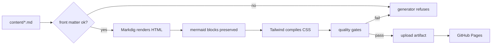

## Sequence diagram

How a comment gets from this page into GitHub Discussions.

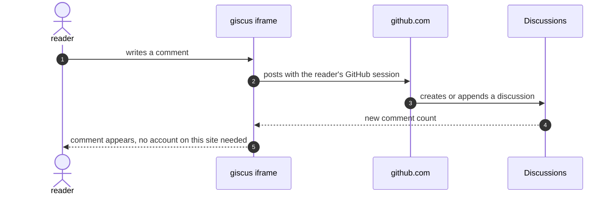

## Class diagram

The content model, simplified to what actually matters.

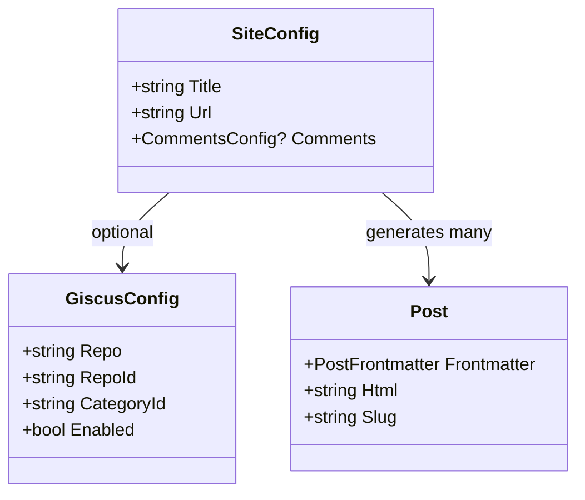

## State diagram

The contact form's state machine, exactly as implemented.

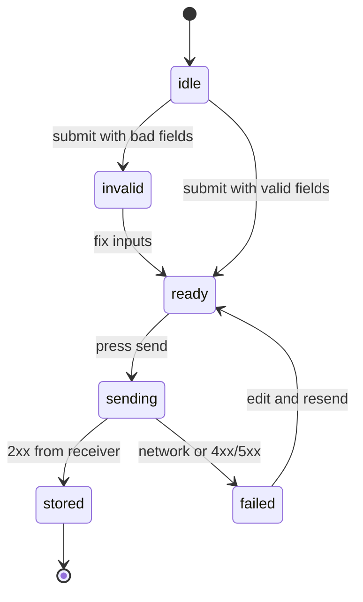

## Entity relationship

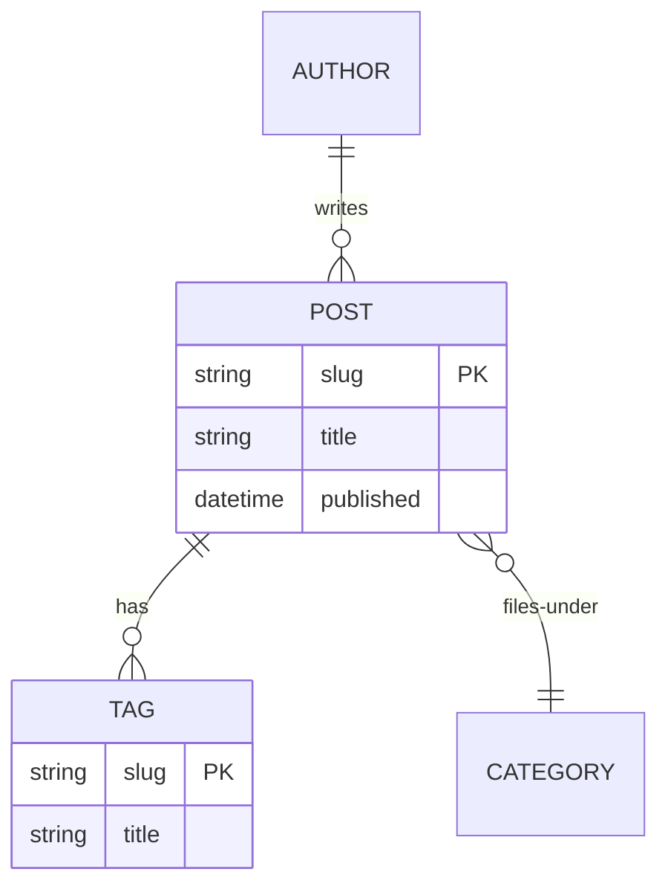

## User journey

Publishing a post here, scored by satisfaction.

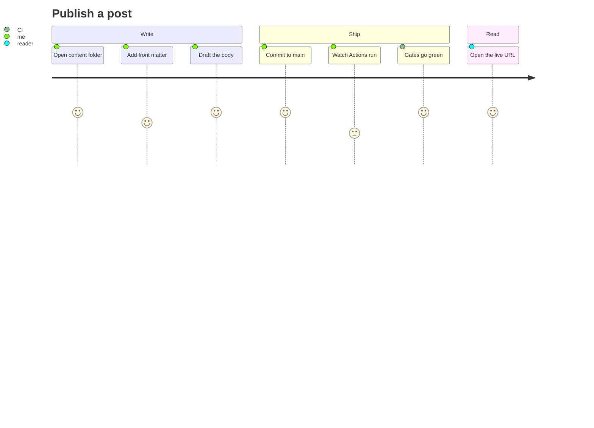

## Gantt

The redesign delivery, compressed.

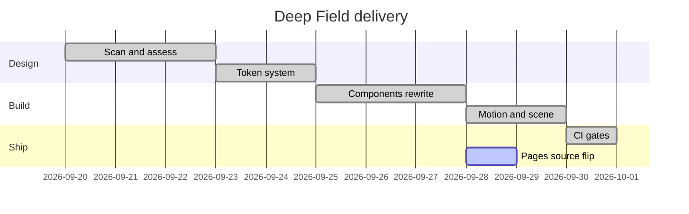

## Pie

Where the build time goes.

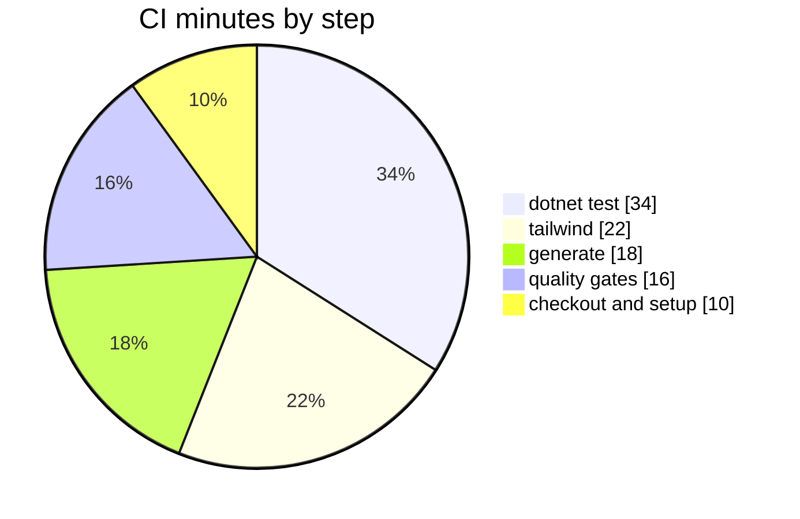

## Git graph

The branch story so far.

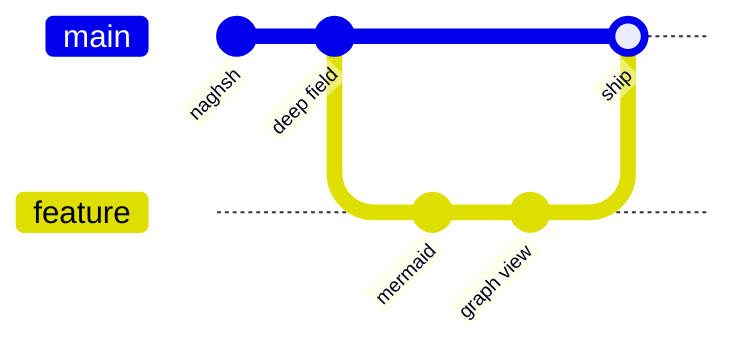

## Mindmap

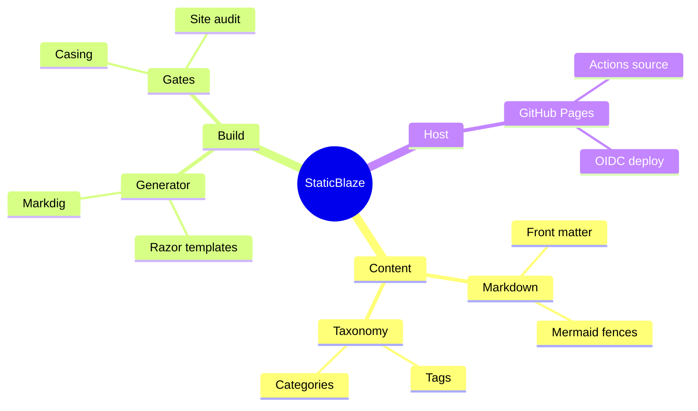

## Timeline

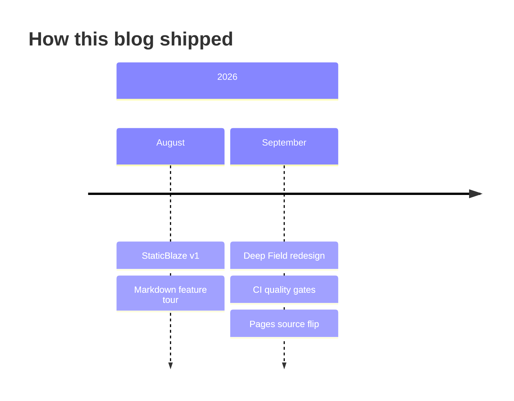

## Quadrant chart

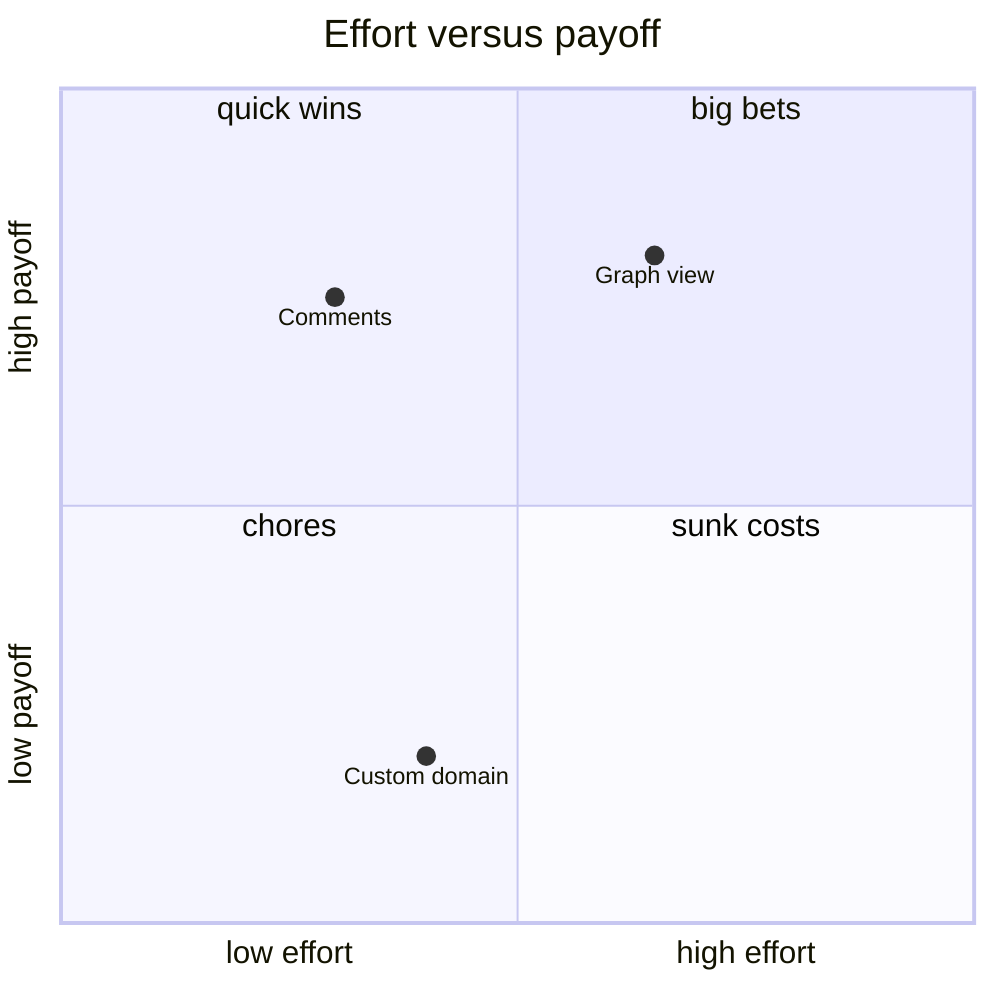

## What the pipeline rejects

The generator is strict on purpose. An undeclared tag, a duplicate canonical, or an empty diagram all fail the build with a named cause. That strictness is what makes a live test post like the one that preceded this article meaningful: if it published, it passed every gate.
