# What Is AI, Really? A Plain-Language Explanation

**AI For Biologists, Part 1**

Most people use AI tools without a clear picture of what is happening on the other side of the screen. Some treat the tool like magic. Others treat it like a search engine that happens to write full sentences. Both pictures lead to the same problem: expectations that do not match what the tool actually is, followed by disappointment or misplaced trust.

This post builds the correct picture from the ground up, using everyday comparisons instead of equations or code.

---

## The idea is old. The chat window is new.

The idea of a machine that thinks is not recent. It was taken seriously as a scientific question as far back as the 1950s, and researchers have worked on it continuously since then. What changed recently is not the idea but the **form** it takes for ordinary people: typing a message to a model such as ChatGPT or Claude and getting a conversational answer back. That experience is only about 3 to 4 years old.

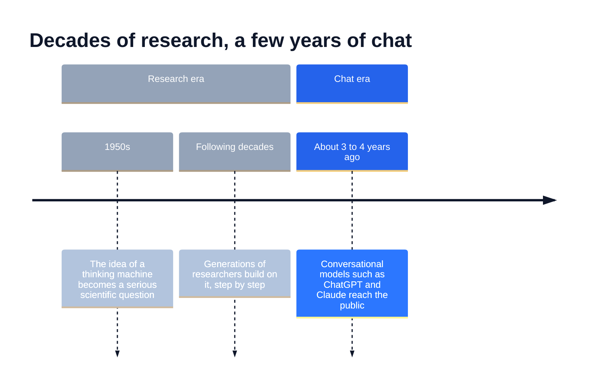
A useful comparison is a therapy that spent decades in laboratories before reaching patients. The science was slowly accumulating the whole time. The moment it became widely available felt sudden, but the foundation was built long before.

The chat interface that feels like a brand-new phenomenon is the most recent link in a long chain of work.

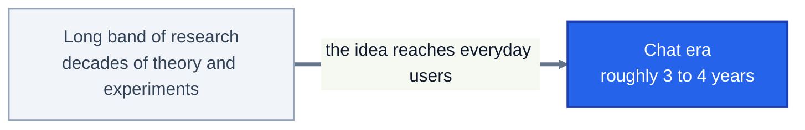

---

## What these models learned from

A language model learns from text, in enormous quantity. The material comes from the internet: articles, books, code, and nearly every other kind of written content.

A close everyday parallel is how a person learns their first language. Nobody hands a toddler a grammar textbook. The child listens to thousands of hours of speech, and patterns settle into place without anyone listing the rules. A language model goes through a similar process, only with written material, and at a scale no human could ever read.

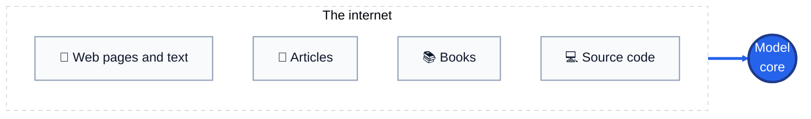

This learning period is called **Training**. It happens once, over a fixed stretch of time, and then it stops. That detail turns out to matter a great deal.

---

## Training is slow and expensive, and that has a side effect

Training takes weeks to months. During that time, thousands of specialized graphics processors run continuously, and the computing cost is very high.

Think of a long-running, resource-heavy experiment. It cannot be repeated every week, because the equipment, the time, and the cost all get in the way. The companies that build these models face the same constraint. A new version of the model cannot be trained every day.

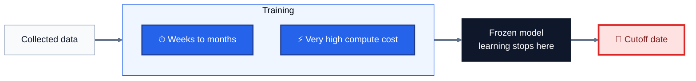

Because Training ends on a specific date, the model's knowledge ends there too.

---

## Knowledge Cutoff

Imagine an encyclopedia printed on a specific day and placed on a shelf. However thorough it is, it contains nothing about what happened the day after printing. The missing pages were never written.

Language models work the same way. Anything that occurred after the end of Training is unknown to the model, because it never saw any data from that period. This boundary is called the **Knowledge Cutoff**.

For example, if a model finished Training early last year, then recent events from the past several months are effectively invisible to it.

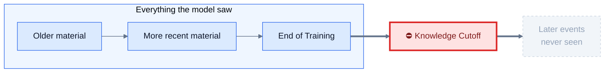

### How web access changes the picture

If the model can search the live web, it can go and fetch what it never learned. It behaves like a person with a closed encyclopedia and an open browser: the book has no new pages, but the answer can still be found.

```mermaid
%%{init: {'theme':'base','themeVariables':{'primaryColor':'#DBEAFE','primaryTextColor':'#0F172A','primaryBorderColor':'#2563EB','lineColor':'#64748B','fontFamily':'Inter, sans-serif'}}}%%
flowchart TB
    classDef q fill:#F8FAFC,stroke:#94A3B8,color:#0F172A
    classDef stop fill:#FEE2E2,stroke:#DC2626,color:#7F1D1D,stroke-width:2px
    classDef go fill:#DCFCE7,stroke:#16A34A,color:#14532D,stroke-width:2px
    classDef wall fill:#FEE2E2,stroke:#DC2626,color:#7F1D1D,stroke-width:3px

    subgraph NOWEB ["Without web search"]
        direction LR
        a1["Question about a recent event"]:::q --> a2["⛔ Cutoff wall"]:::wall --> a3["Cannot answer reliably"]:::stop
    end
    subgraph WEB ["With web access"]
        direction LR
        b1["Question about a recent event"]:::q --> b2["🌐 Live search"]:::go --> b3["Fresh information brought across the wall"]:::go
    end
    style NOWEB fill:#FFF7F7,stroke:#FCA5A5
    style WEB fill:#F0FDF4,stroke:#86EFAC
```

This is why the Knowledge Cutoff is felt much less in current models than it used to be. One distinction is still worth holding on to: web access supplies **new information**, but the model's underlying knowledge and its command of language still come from the Training period.

---

## What a language model actually does

Underneath the fluent answers, a language model is a large **statistical system**. Given some text, it predicts the most likely continuation.

Everyone does a small version of this already. If someone begins a sentence with "The weather today is really ..." the mind immediately offers candidates such as "cold", "hot", or "nice". Words like "complicated" can technically fit, but they are far less probable, so they barely cross the mind.

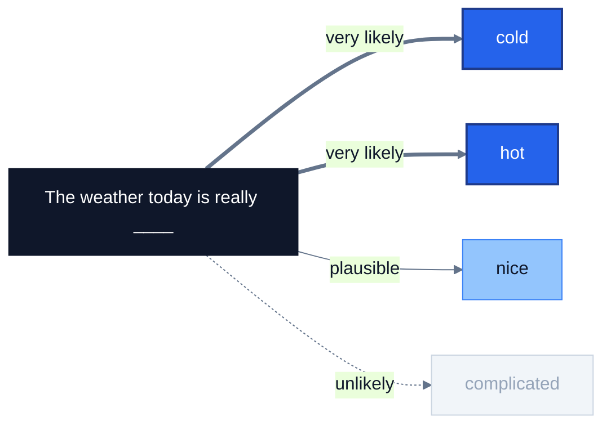

The model performs this same guess, at vastly greater scale, and then repeats it. It picks a word, appends it to the text, and uses the longer text to pick the next word. A full answer is produced by running this loop many times in a row.

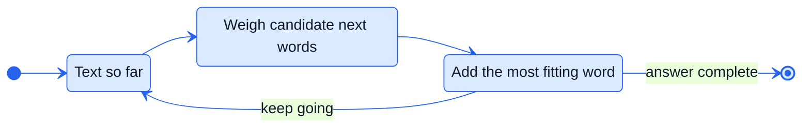

The guesses rest on billions of internal numerical settings. During Training, those numbers were adjusted according to the patterns present in the data.

---

## From raw predictor to assistant

If the model only continues text, why does it answer questions instead of simply continuing them?

A raw text predictor given "What is the capital of France?" may produce more questions, such as "What is the capital of Germany? What is the capital of Spain?", because question lists like that are common in written material. Continuing the text is exactly what it was built to do.

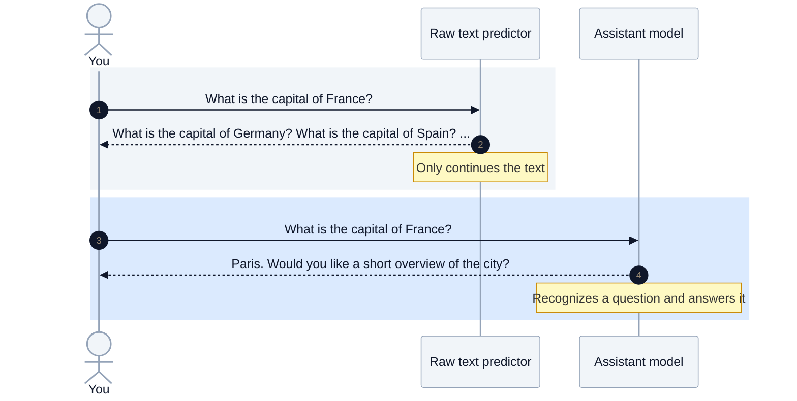

The difference comes from the final phase of Training, which uses **real human conversations** and **human evaluation**. People read the model's answers and rate them, and the model learns which kinds of answers are more helpful, more accurate, and more polite.

An apprentice who has read widely but never worked with anyone offers a fair comparison. Later, working next to an experienced colleague and receiving feedback, the apprentice learns how to put that reading to use for the person asking. The knowledge was already there. The feedback stage shaped how it gets delivered.

---

## Patterns, not memory

A common assumption is that the model stores the text it saw, like a giant searchable database. That is not how it works.

The model did not memorize billions of sentences word for word. It extracted **patterns** from them: patterns of language, of grammar, and even of reasoning. These patterns are stored in its internal structure, a neural network, and not in an archive of documents that can be looked up.

The distinction is clearest with two exam candidates. One memorized the exact answers to every past exam. The other understood the underlying concepts. On a repeated question, both succeed. On a question nobody has asked before, the first gets stuck and the second works it out.

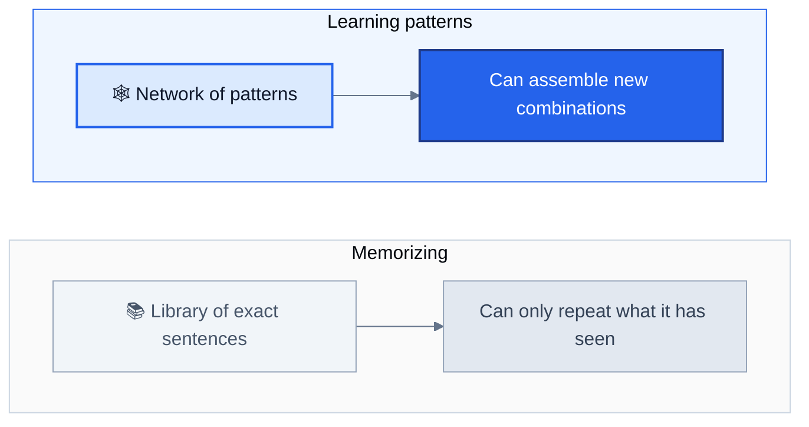

A person who has absorbed the rules of a language can produce a sentence nobody has ever said before, and still be perfectly understood. The same ability is what lets the model produce combinations that did not exist in its training material in exactly that form.

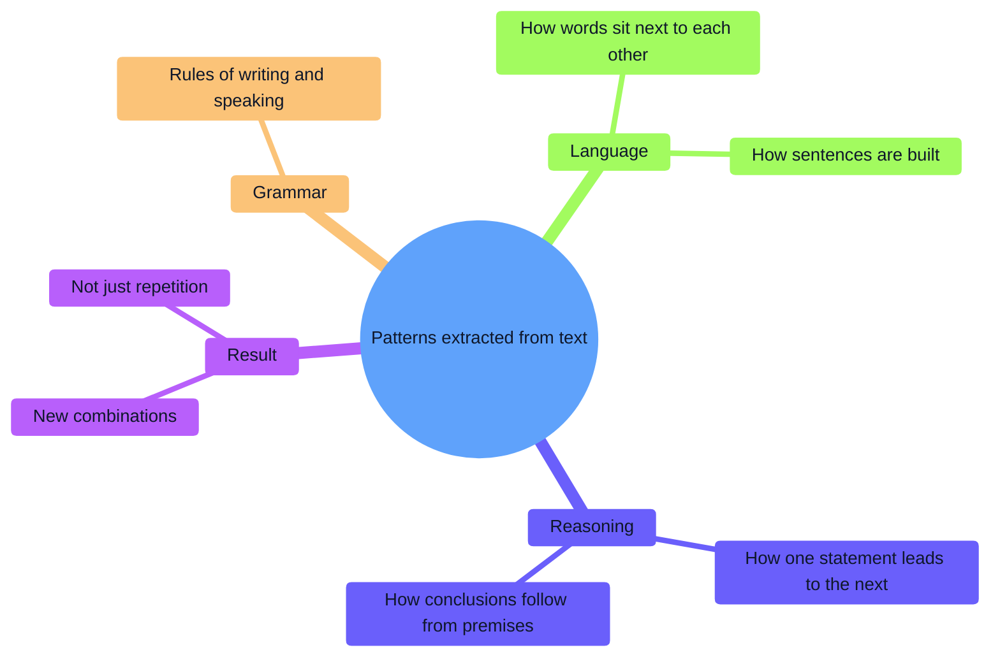

---

## Breadth over depth

The material the model learned from was gathered for **comprehensiveness**, not for specialist depth in any one area.

Consider a narrow, technical topic. Suppose a thousand careful scientific papers exist on it. Online, there is usually several times that volume of general, simplified, and sometimes outright wrong content about the same topic, spread across blogs, forums, and social media. The model saw all of it. Because its learning is driven by volume and frequency, it cannot automatically tell which source is more authoritative, unless it was specifically designed and trained to do so.

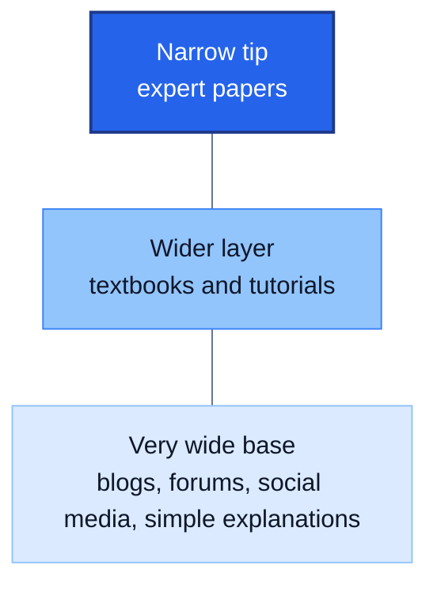

Picture learning what a dish tastes like by reading every opinion ever written about it. Most opinions come from ordinary diners, and a small fraction from professional chefs. The result is a broad and useful sense of the dish, but not the precision of a chef.

---

## The view from the research frontier

A researcher working at the edge of a field is often underwhelmed by these tools at first contact. The reason follows directly from how they are built. Someone pushing the boundary of knowledge expects a conversation partner operating at their own level of expertise, while the model was trained on material that **already exists**. The frontier is, by definition, where little has been written yet.

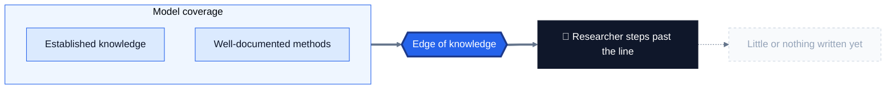

It works like an explorer's map. The map is excellent for everything already charted, and blank beyond its edge. The same pattern shows up more generally: people who work deep inside one specialty tend to stay in their comfortable zone, and as a result they miss most of what the tool can do across the surrounding territory.

---

## The right mental model

Given all of the above, the most accurate framing is this. The tool is **not a peer-level colleague**. It is closer to an **undergraduate-level assistant with surface-level competence across nearly every field**: the breadth of all disciplines rather than the depth of one specialist.

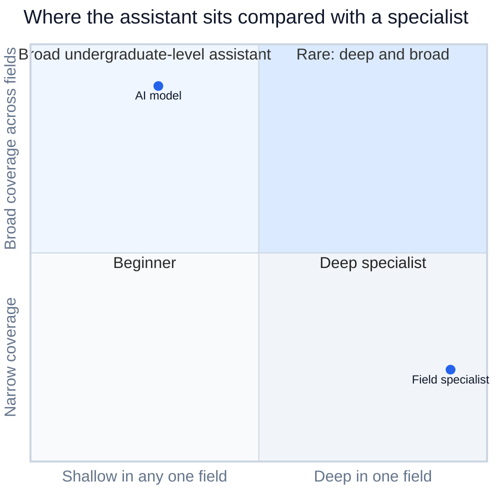

| Peer-level colleague (wrong expectation) | Undergraduate-level assistant across all fields (accurate expectation) |
|---|---|
| Expected to match a specialist's analysis | Expected to know a lot, broadly, at a foundational level |
| Falls short, and the answers feel shallow | Useful for the supporting work around the specialist's own analysis |
| One person's depth in one area | Working knowledge of nearly every area at once |

An assistant like this will not replace a specialist's own analysis. What it can do is handle the surrounding, supporting tasks much faster than before, and that difference in how the tool is viewed is what determines how much value it delivers.

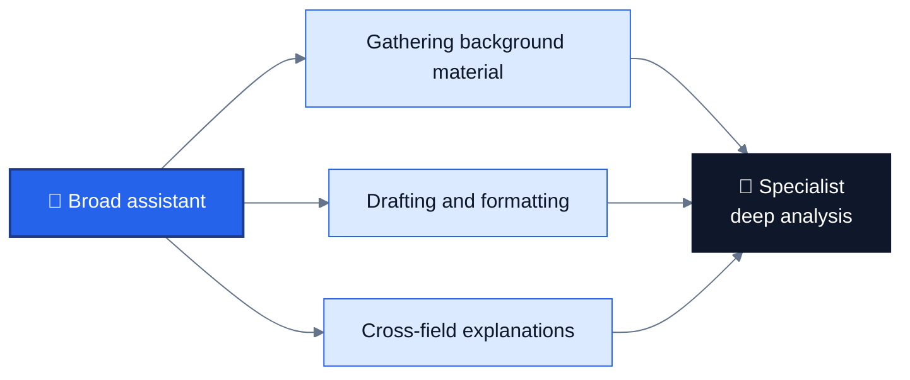

